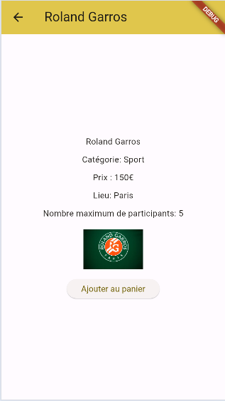
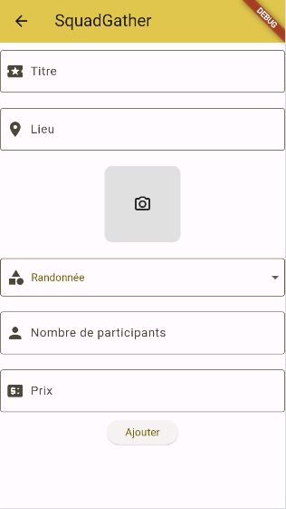

# squadgather

Il s'agit d'un projet réalisé dans le cadre du Master 2 MIAGE INTENSE
Le projet a pour but de s'initier à l'utilisation du Framework Flutter. 

## Résumé de l'application
L'application permet de visualiser, modifier ou encore ajouter des activités à réaliser. 
On retrouve dans chaque activité différentes informations comme son nom, le lieu, le prix ou encore le nombre de participants. 
L'application permet à l'utilisateur d'ajouter une ou plusieurs activités à son panier. 
L'utilisateur peut également visualiser et modifier son profile. 

Un système de filtres a été mis en place pour afficher les activités. En effet, l'utilisateur a la possibilité de trier les activités par thème ou non via une Tab Bar. 

Une Bottom Bar permet la navigation entre différents écrans qui sont : La liste d'activté, Le panier utilisateur et enfin Le profile de l'utilisateur. 

## Les User story :
Un cahier des charges a été délivré afin d'exprimer les fonctionnalitées primordiales au projet. 
D'autres fonctionnalités ont été ajoutés par mes soins afin d'aller plus loin. 

Voici la presentation des User story demandées : 
#### US#1 : [MVP] Interface de login
-  L'utilisateur doit avoir un écran le laissant de connecter via un login et un mot de passe 

#### US#2 : [MVP] Liste des activités
-  L'utilisateur, après s'être connecté, a la possibilité de voir la liste d'activités 

#### US#3 : [MVP] Détail d’une activité
-  Lorsque l'utilisateur appuis sur une activité, il peut voir plus d'information concernant l'activité en question. Il pourra ajouter l'activité à son panier 

#### US#4 : [MVP] Le panier
-  Via le Bottom menu, l'utilisateur peut naviguer vers le panier où il pourra visualiser les activités sur lequelles il veut participer

#### US#5 : [MVP] Profil utilisateur
-  L'utilisateur peut visualiser et modifer les informations sur son profil sauf son login. Il peut également se déconnecter. 

#### US#6 : Filtrer sur la liste des activités
-  L'utilisateur a la possibilité de filtrer la liste d'activité par catégorie. 

#### US#7 : Laisser libre cours à votre imagination
-  La page d'inscription a été mise en place permettant d'ajouter plusieurs utilisateurs

-  Le filtre des activités a été aussi mis sur le panier de l'utilisateur. 
-  L'utilisateur peut modifier les activités actuels (tous les utilisteurs ont ce droit car l'implémentation des rôles utilisateurs n'a pas été mis en place). Il suffit d'appuyer sur le crayon blue

-  L'utilisateur peut supprimer une activité de la liste via l'icon rouge de la poubelle. Une boite de dialog lui demandera si il est sûre de supprimer cette activité. Cette fonctionnalité a également été mise en place sur le panier

-  L'utilisateur peut ajouter une nouvelle activité en cliquant sur le bouton "Ajouter" puis en remplissant le formulaire. Pour l'image, l'utilisateur pourra choisir une image se trouvant sur son appareil mobile (ne fonctionne pas sur un navigateur web). Les images sont stockées sur Cloudinary. 
